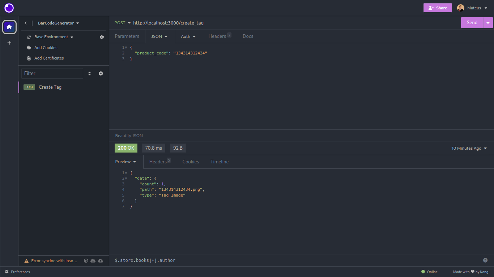
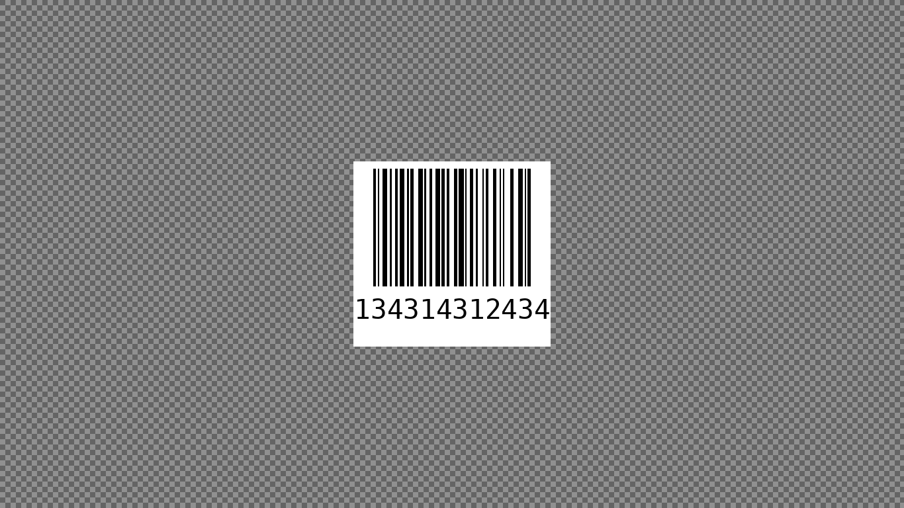

# BarCodeGenerator - Barcode Generation API
[](https://www.python.org/downloads/release)
[](https://docs.djangoproject.com/en/stable/releases/)

## Overview

This project, developed as part of [Rocketseat](https://www.rocketseat.com.br/)'s Next Level Week (NLW) event in the Python Expert track, is an API specialized in barcode generation. It provides an efficient solution for the quick and easy creation of barcodes in projects that require this functionality.

The API will be available at http://localhost:3000.




## Main Features

- Barcode generation from provided data.
- API for easy integration into various types of projects.

## Requirements

- [Python 3.x](https://www.python.org/downloads/release/python-3100/)
- [Poetry](https://python-poetry.org/)
- Required Python libraries (listed in the `pyproject.toml` file).

## How to Use

1. **Clone the repository:**
```bash
git clone https://github.com/your-username/nlw-python-expert.git

2. **Install the dependencies:**
```bash
poeetry install

3. **Run the application:**
```bash
python3 run.py
